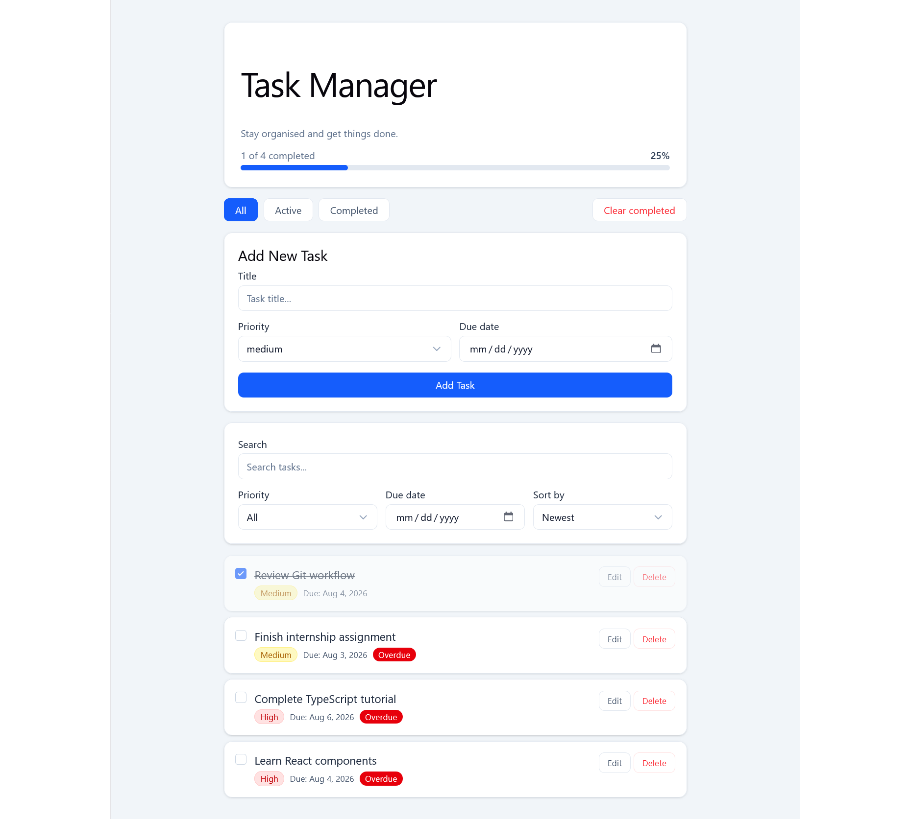

# Task Manager (V4) – Accessibility Pass

## Overview

Run an accessibility pass on the Task Manager app: semantic HTML, labels, keyboard navigation, and colour contrast — then fix all issues found.

## What Changed

### Semantic HTML

- Replaced `<div>` wrappers with proper landmarks: `<header>`, `<main>`, `<nav>`, `<ul>`, `<li>`
- Wrapped the Add Task form in a `<section>` with `aria-labelledby`

### Labels & ARIA

- Added `aria-label` to the progress bar, each checkbox (includes task title), Edit button, and Delete button
- Added `aria-labelledby` to Radix Select triggers (Priority, Sort) since `htmlFor` doesn't work on non-native inputs
- Added `aria-label` to all unlabelled inputs in the edit state (title, priority, date)
- Added `aria-pressed` to filter buttons to announce the active filter to screen readers
- Added `aria-hidden="true"` to all decorative SVG icons

### Keyboard Navigation

- All interactive elements reachable and operable via keyboard alone
- Pressing **Escape** while editing a task cancels the edit
- Added `focus-visible` ring styles to buttons that were missing a visible focus indicator

### Colour Contrast

- Replaced `text-slate-400` with `text-slate-500` / `text-slate-600` on small text to meet WCAG AA (4.5:1 ratio)
- Added `text-slate-900` to inputs and select triggers so typed and selected values are clearly readable

## Screenshot



## Skills Practised

Accessibility (a11y)

## Deliverable

Accessible UI

## Getting Started

```bash
npm install
npm run dev
```
